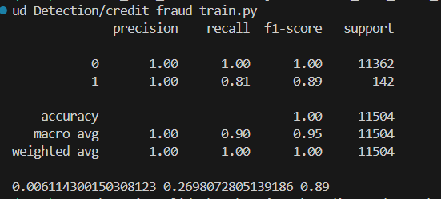
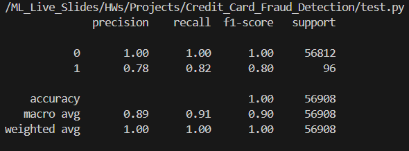
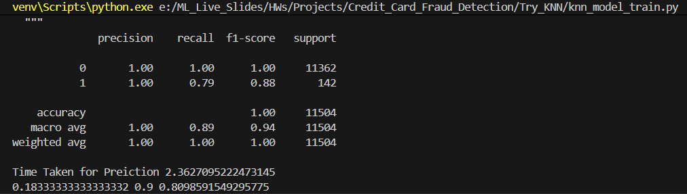
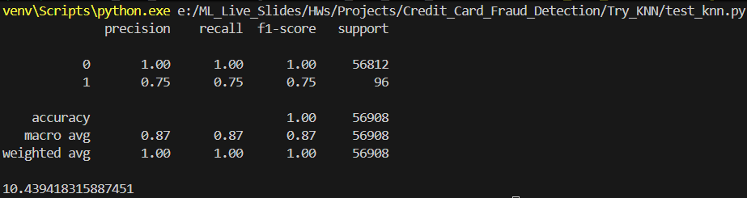

# Credit Card Fraud Detection  
<p>
  
</p>

<h3>
  This project credit card fraud detection aims to able to classify the fraud  
transactions in by given 31 features and 56960 examples but there are 28  
feature are anonymous, also the data is highly unbalanced with just 0.172%  
positive class ration, so we focuses on F1-score then recall, and try several  
algorithms (logistic regression, random forest, voting classifier, xgboost, lightboost, cat-boost) we reach for the highest f1-score from random forest with  
[Val_f1score: 89% and Test_f1score: 80%], after applying preprocessing remove  
duplicates, transform time, apply MinMaxScaling, apply Ovesampling with factor:  
80

</h3>

***From EDA***
*  The Data is Highly imbalanced with only 0.00157% positive class  
* All features (except target) are floats  
* Most of the features are Anonymous and normalized, 28 features  
* the data is very weak (very low correlation)  
* there is no missing data (Clean)  


This project inspired from Kaggle competition: [Kaggle Fraud Detection](https://www.kaggle.com/datasets/mlg-ulb/creditcardfraud/code?datasetId=310&sortBy=voteCount&searchQuery=tsne).  
```
CREDIT_CARD_FRAUD_DETECTION/
│── data/                       
│   └── split/                 
│       ├── train.csv
│       ├── val.csv
│       ├── test.csv
│       └── trainval.csv
│
│── outputs/                    
│
│── Try_KNN/                    
│   ├── eval_knn.py             
│   ├── knn_model_train.py      
│   ├── test_knn.py             
│   └── __pycache__/           
│
│── utils/                    
│
│── venv/                     
│
│── .gitignore                 
│── config.yaml                
│
│── credit_fraud_train.py      
│── credit_fraud_utils_data.py 
│── credit_fraud_utils_eval.py
│
│── EDA.ipynb                
│── logging.txt              
│
│── model.pkl                 
│── model_val.pkl               
│── model_knn.pkl              
│── model_knn_val.pkl       
│
│── report.docx                
│── report.pdf             
│
│── requirments.txt          
│── test.py           
```

## Initialization & Setup

### 1- Clone Repository
```bash 
git clone https://github.com/yourusername/Credit_Card_Fraud_Detection.git
cd Credit_Card_Fraud_Detection
```
### 2- Create Virtual Environment
```
python -m venv venv
```

Activate it:
Windows: ```venv\Scripts\activate```

Linux/Mac: ```source venv/bin/activate```

### 3- Install Requirments
```pip install -r requirements.txt```

### 4- Usage 

using random forest:
run training-validation:  ```python credit_fraud_train.py --config config.yaml```
run testing: ```python test.py --config config.yaml```

or if you want to using k-means:
run training-validation:  ```python Try_KNN\knn_model_train.py --config config.yaml```
run testing: ```python Try_KNN\test_knn.py --config config.yaml```


## Configuration
```
random_state: 42

dataset:
  train_path: 'data/split/train.csv'
  val_path : 'data/split/val.csv'
  train_val_path: 'data/split/trainval.csv'
  test_path: 'data/split/test.csv'


preprocessing:
  remove_dublicates: True
  remove_outlier: False
  change_time: True
  data_choice: 2
  is_scaling: True
  scaler_option: 1
  sample_option: 2
  over_factor: 80
  under_factor: 80
  over_strategy: 'smote'


model:
  type: "RandomForest"

  random_forest_params:
    n_estimators: 50
    max_depth: 9
  
  logistic_regression:
    fit_intercept: True
    random_state : 42
    solver: 'sag'
    max_iter: 10000

  voting_classifier:
    fit_intercept: True
    max_iter: 10000
    max_depth: 9
    n_estimators: 50

  xgboost:
    max_depth: 3
    lr: 0.2
    n_estimators: 100

  light_boost:
    n_estimators: 500
    lr: 0.05
    max_depth: 3

  cat_boost:
    depth: 3
    iterations: 100
    lr: 0.1

  knn:
    n_neighbours: 60
    apply_pca: True
    apply_kmeans: False
    n_components: 4
    neg_samples: 405
```
if you want to change the model just change model/type

## Results
| Model              | F1-score (data as it is) | F1-score (undersampling) | F1-score (oversampling) |
|--------------------|--------------------------|--------------------------|--------------------------|
| Logistic Regression | 88%                      | 80%                      | 89%                      |
| Random Forest       | 88%                      | 88%                      | 89%                      |
| XGBoost             | 77%                      | 88%                      | 89%                      |
| LightGBM            | 79%                      | 84%                      | 83%                      |
| CatBoost            | 88%                      | 80%                      | 89%                      |
| KNN                 | 56%                      | 62%                      | 88%                      |


<h2>
  Random Forest:
</h2>

We chose the Random Forest classifier model with parameters: ***Max_depth=9***
and ***n_estimators = 50***
Results:
`Val_f1-score: f1-score 89% & Recall 81%`

<p>
  
</p>

`Test: f1-score 80% & Recall 82%`
<p>
  
</p>

<h2>
  KNN:
</h2>

We try k nearest neighbors (knn) classifier with the same preprocessing
(cleaning, scaling, sampling) and use PCA to do feature reduction to reduce the
time for prediction and reduce time in train-val from ***1.33 to 0.44*** seconds but it
reduces the f1-score form 88% to 85% so we will choose without PCA.
We tunning to get the best ***n-neighbor 60, n_component 4***
Results:
`Train_Val: f1-score 88% & Recall 79%`

<p>
  
</p>

`Test: f1-score 75% & Recall 75%`
<p>
  
</p>


Author: ***[Ahmed Diab](https://www.linkedin.com/in/ahmed-diab-3b0631245/)***


