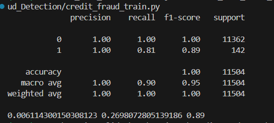
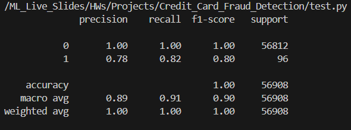
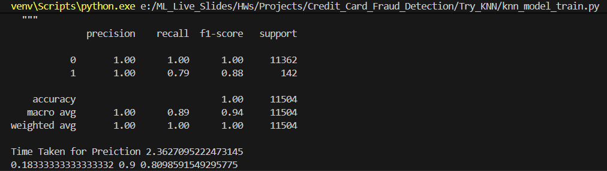
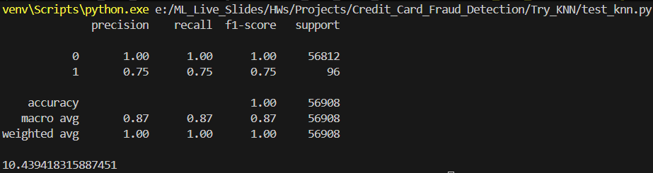

# Credit Card Fraud Detection  
<p>
  
</p>

<h3>
  This project for credit card fraud detection aims to classify fraud transactions using 31 features across 284,807 examples. The data is highly unbalanced (0.172% positive class), so we focus on F1-score and Recall. After trying several algorithms (Logistic Regression, Random Forest, XGBoost, LightGBM, CatBoost, Decision Tree, SVM, Kernel SVM, and Naive Bayes), we achieved the highest F1-score of 89% with Random Forest, SVM, and Kernel SVM using oversampling.

</h3>

***From EDA***
*  The Data is Highly imbalanced with only 0.00157% positive class  
* All features (except target) are floats  
* Most of the features are Anonymous and normalized, 28 features  
* the data is very weak (very low correlation)  
* there is no missing data (Clean)  


This project inspired from Kaggle competition: [Kaggle Fraud Detection](https://www.kaggle.com/datasets/mlg-ulb/creditcardfraud/code?datasetId=310&sortBy=voteCount&searchQuery=tsne).  
```
│── backend/                    
│   ├── main.py                 # FastAPI application
│
│── data/                       
│   └── split/                 
│       ├── train.csv
│       ├── val.csv
│       ├── test.csv
│       └── trainval.csv
│
│── outputs/                    
│
│── Try_KNN/                    
│   ├── eval_knn.py             
│   ├── knn_model_train.py      
│   ├── test_knn.py             
│   └── __pycache__/           
│
│── utils/                    
│   ├── helper_fun.py
│
│── venv/                     
│
│── .gitignore                 
│── config.yaml                
│
│── credit_fraud_train.py      
│── credit_fraud_utils_data.py 
│── credit_fraud_utils_eval.py
│
│── EDA.ipynb                
│── logging.txt              
│
│── model.pkl                 
│── model_val.pkl               
│── model_knn.pkl              
│── model_knn_val.pkl       
│
│── report.docx                
│── report.pdf             
│
│── requirments.txt          
│── test.py           
│── test_api.py                 # API test script
```

## Initialization & Setup

### 1- Clone Repository
```bash 
git clone https://github.com/yourusername/Credit_Card_Fraud_Detection.git
cd Credit_Card_Fraud_Detection
```
### 2- Create Virtual Environment
```
python -m venv venv
```

Activate it:
Windows: ```venv\Scripts\activate```

Linux/Mac: ```source venv/bin/activate```

### 3- Install Requirments
```pip install -r requirements.txt```

### 4- Usage 

using random forest:
run training-validation:  ```python credit_fraud_train.py --config config.yaml```
run testing: ```python test.py --config config.yaml```

or if you want to using k-means:
run training-validation:  ```python Try_KNN\knn_model_train.py --config config.yaml```
run testing: ```python Try_KNN\test_knn.py --config config.yaml```

### 5- Running Backend (FastAPI)
To start the fraud detection API:
```bash
uvicorn backend.main:app --reload
```
Access interactive documentation at: `http://127.0.0.1:8000/docs`


## Configuration
```
random_state: 42

dataset:
  train_path: 'data/split/train.csv'
  val_path : 'data/split/val.csv'
  train_val_path: 'data/split/trainval.csv'
  test_path: 'data/split/test.csv'
  zero_weight: 1
  one_weight: 1
  target_rec: 0.9
  target_prc: 0.9
  eval_target: 'recall'


preprocessing:
    data_choice: 2 
    is_scaling: True
    scaler_option: 1
    sample_option: 2
    over_factor: 80
    under_factor: 80
    over_strategy: 'smote'
    k_neig: 3
    remove_dublicates: True
    remove_outlier: False
    change_time: True
    train_val: True


model:

  random_forest_params:
    params: 
      n_estimators: 50
      max_depth: 9
      random_state : 42

  logistic_regression:
    params:
      fit_intercept: True
      solver: 'sag'
      max_iter: 10000
      random_state : 42

  voting_classifier:
    params:
      model1:
        solver: 'sag'
        fit_intercept: True
        max_iter: 10000
        random_state : 42

      model2:
        max_depth: 9
        n_estimators: 50
        random_state : 42
      voting: 'hard'
      

  xgboost:
    params:
      max_depth: 3
      lr: 0.2
      n_estimators: 100
      random_state : 42

  light_boost:
    params:
      n_estimators: 500
      lr: 0.05
      max_depth: 3
      random_state : 42

  cat_boost:
    params:
      depth: 3
      iterations: 100
      lr: 0.1
      random_state : 42

  knn:
    params:
      n_neighbours: 60
      apply_pca: False
      apply_kmeans: False
      n_components: 4
      neg_samples: 405

```
if you want to change the model just change model/type in `credit_fraud_train` file

## Results
| Model              | F1-score (data as it is) | F1-score (undersampling) | F1-score (oversampling) |
|--------------------|--------------------------|--------------------------|--------------------------|
| Logistic Regression | 88%                      | 80%                      | 89%                      |
| Random Forest       | 88%                      | 88%                      | 89%                      |
| XGBoost             | 77%                      | 88%                      | 89%                      |
| LightGBM            | 79%                      | 84%                      | 83%                      |
| CatBoost            | 88%                      | 80%                      | 89%                      |
| KNN                 | 56%                      | 62%                      | 88%                      |
| Decision Tree       | -                        | -                        | 84%                      |
| SVM                 | -                        | -                        | 89%                      |
| Kernel SVM          | -                        | -                        | 89%                      |
| Naive Bayes         | -                        | -                        | 46%                      |


<h2>
  Random Forest:
</h2>

We chose the Random Forest classifier model with parameters: ***Max_depth=9***
and ***n_estimators = 50***
Results:
`Val_f1-score: f1-score 89% & Recall 81%`

<p>
  
</p>

`Test: f1-score 80% & Recall 82%`
<p>
  
</p>

<h2>
  KNN:
</h2>

We try k nearest neighbors (knn) classifier with the same preprocessing
(cleaning, scaling, sampling) and use PCA to do feature reduction to reduce the
time for prediction and reduce time in train-val from ***1.33 to 0.44*** seconds but it
reduces the f1-score form 88% to 85% so we will choose without PCA.
We tunning to get the best ***n-neighbor 60, n_component 4***
Results:
`Train_Val: f1-score 88% & Recall 79%`

<p>
  
</p>

`Test: f1-score 75% & Recall 75%`
<p>
  
</p>


<h2>
  Decision Tree:
</h2>

Results:
`Val_f1-score: 84% & Recall 75%`

<h2>
  SVM:
</h2>

Results:
`Val_f1-score: 89% & Recall 81%`
`Best Threshold: 0.0030, Precision: 0.3768, Recall: 0.9`

<h2>
  Kernel SVM:
</h2>

Results:
`Val_f1-score: 89% & Recall 81%`
`Best Threshold: 0.0022, Precision: 0.0441, Recall: 0.9`

<h2>
  Naive Bayes:
</h2>

Results:
`Val_f1-score: 46% & Recall 81%`
`Best Threshold: 1.43e-09, Precision: 0.1526, Recall: 0.9`


## FastAPI Backend Documentation

The backend provides a RESTful API for real-time fraud detection.

### 1. Predict Single/Multiple Transactions
**Endpoint:** `POST /predict`

**Input Example (JSON):**
```json
{
  "Time": 168239.0,
  "V1": -0.01437659,
  "V2": 0.98471741,
  "V3": -0.75409588,
  "V4": -0.10457889,
  "V5": 0.85529521,
  "V6": -0.90063147,
  "V7": 1.16906120,
  "V8": -0.12214994,
  "V9": -0.32458167,
  "V10": -1.63691535,
  "V11": 1.38135580,
  "V12": 0.47525145,
  "V13": -0.07675981,
  "V14": -2.61993077,
  "V15": -1.53783787,
  "V16": 0.46389858,
  "V17": 1.73371224,
  "V18": 1.10918967,
  "V19": -0.29836004,
  "V20": 0.02270194,
  "V21": 0.15420594,
  "V22": 0.61171807,
  "V23": -0.18690965,
  "V24": -0.12177678,
  "V25": -0.07013771,
  "V26": 0.62936032,
  "V27": 0.02185044,
  "V28": 0.07728146,
  "Amount": 58.31
}
```

**Output Example:**
```json
[
  {
    "prediction": "Normal",
    "is_fraud": false,
    "probability": 0.0027874030745543084
  }
]
```

### 2. Batch Prediction (CSV)
**Endpoint:** `POST /predict_csv`

**Input:** A CSV file with the same features as the training data (Time, V1-V28, Amount).

**Output Example:**
```json
[
  {
    "index": 0,
    "prediction": "Normal",
    "is_fraud": false,
    "probability": 0.0027874030745543084
  }
]
```


